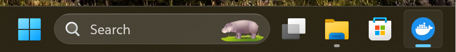
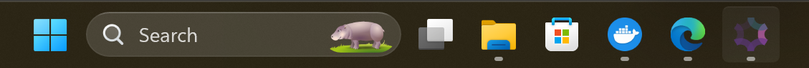
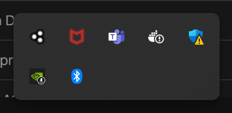
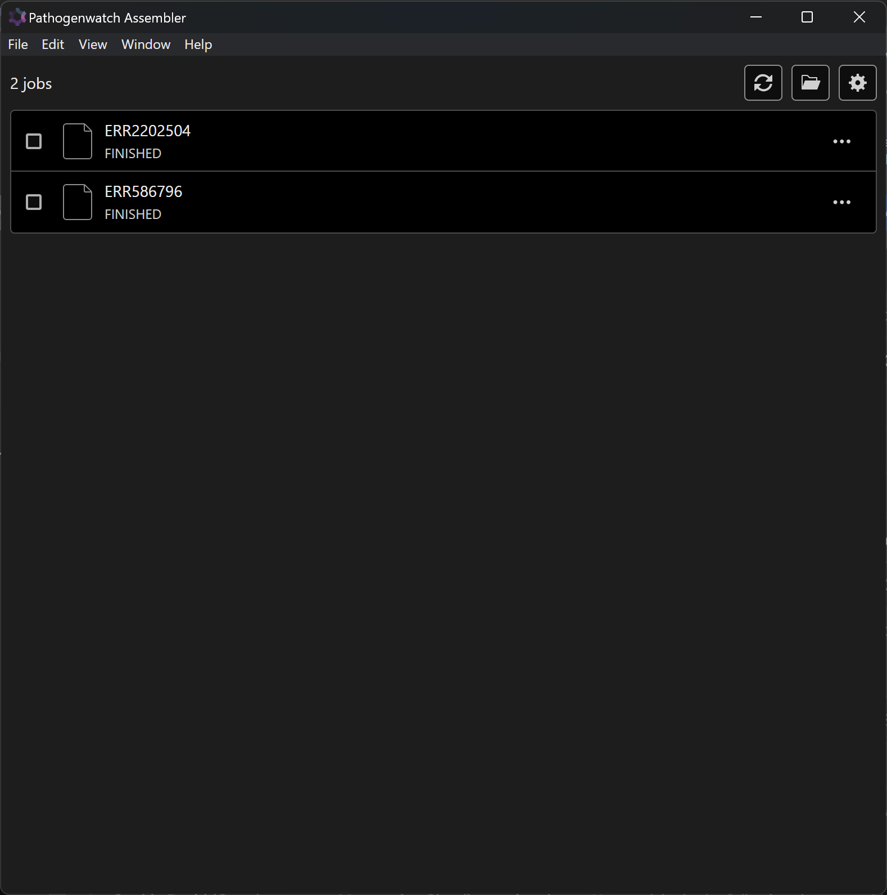
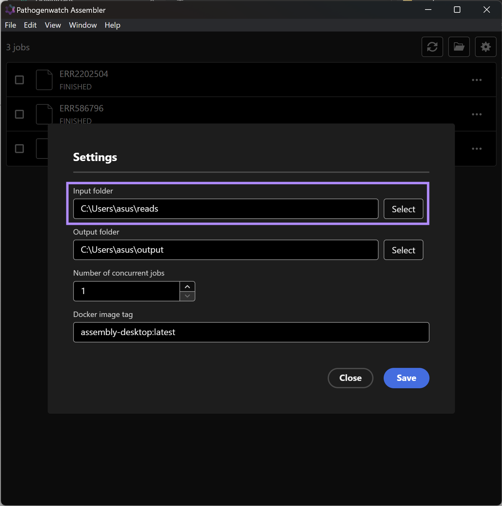
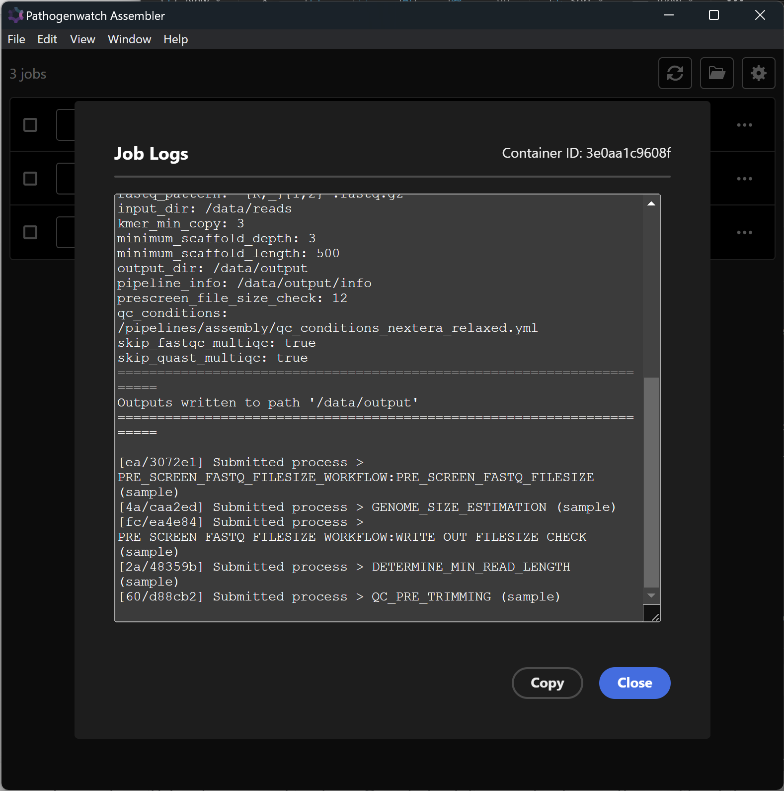
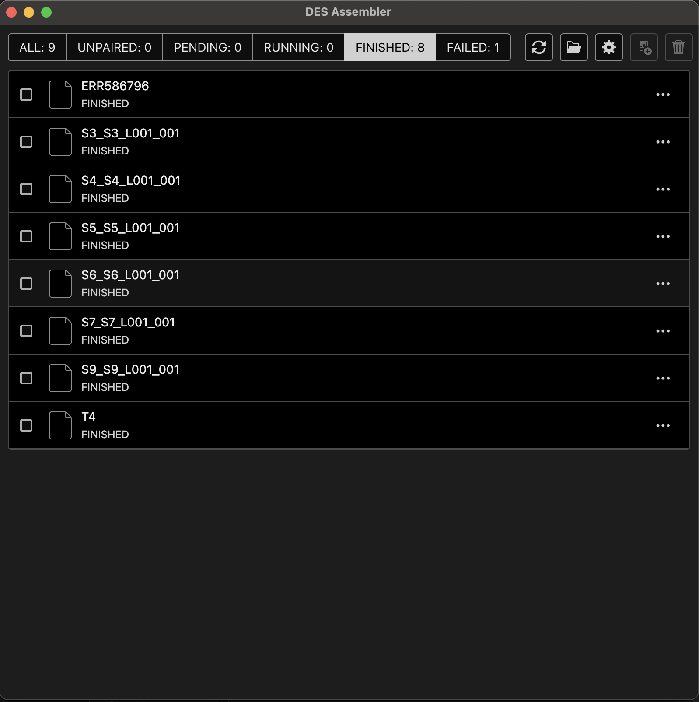
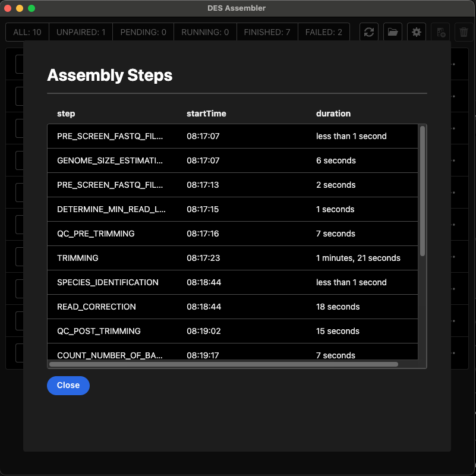

# DES Assembler protocol

> v 1.0.0

In this page, we will describe the standard workflow to assembling a bacterial genome taking in illumina paired-end reads in `fastq` format.

## 1. Setting up ##

To run the **DES Assembler app**, your computer requires:

* Docker Desktop installed on your computer.
* The **DES Assembler app** installed on your computer.

### Starting Docker desktop ###

If Docker Desktop is currently active, you'll notice the Docker logo icon {width="4%"} displayed in your taskbar.

If you suspect that Docker Desktop isn't running, simply double-click on the Docker icon {width="4%"} on your desktop. This action will initiate and activate Docker in the background. 

### Starting the DES Assembler app ###

If the **DES Assembler app** is already active, you'll notice its icon {width="4%"} displayed in your desktop taskbar.

or in your system tray.

If you suspect that the **DES Assembler app** isn't running, simply double-click on the **DES Assembler app** icon {width="4%"} on your desktop. This will launch the **DES Assembler app**.

## 2. Selecting files for assembly ##

Your computer is now ready to start assembling genomes. This step requires a pair of `fastq` files from an illumina sequencing experiment per genome. When you move these two files to the designated folder, the **DES Assembler app** will detect them and start the assembly process. Once the assembly process is finalized, you will have access to the assembled data in `fasta` format, along with its corresponding quality metrics file.

### Open the DES Assembler app ###

Click on the DES Assembler app icon {width="4%"} in your taskbar.

This will bring the **DES Assembler app** app to the front, and it should look like this.

{width="60%"}

### Drag and drop files for assembly ###

!!! warning 
    Your paired `fastq` file should end in one of the following formats:

    * `{ID}_L001_R1_001.fastq.gz` and `{ID}_L001_R2_001.fastq.gz`

Open the designated input folder by clicking on the folder icon {width="4%"} in the **DES Assembler app**. This will open the designated input folder. 

!!! important
    You can change the input folder clicking on the settings icon {width="4%"}, and changing the directory in the `input folder` field. Finally, click on **Save**.
    
    {width="60%"}    

Select the `fastq` files from the genomes you would like to assemble and move them to that designated folder. The **DES Assembler app** will detect the files in the input directory and start the assembly process.

## 3. Assembly progress ##

The **DES Assembler app** will identify any new files within the input directory. These files will appear in the app labeled with the name preceding the `_` character. For instance, if your input files are named `bacteria_1.fastq.gz` and `bacteria_2.fastq.gz`, then the app will display the input genomic data as **`bacteria`**.

Each genome will be assigned one of the following status:

* **`UNPAIRED`** : The app has detected only one of the two paired `fastq` files

!!! tip
    If you think you have moved both `fastq` files to the input directory, make sure the name of both files is **identical**.
    For example, `salmonella_1.fastq.gz` and `salmonela_2.fastq.gz` will be detected by the app as two different genomes: `salmonella` and `salmonela`, and they will both have the `UNPAIRED` status.

* **`PENDING`** : The app is currently running the maximum number of concurrent jobs it is allow to run. An entry with a `PENDING` status is in the queue and will start as `RUNNING` jobs move to the `FINISHED` or `FAILED` status.
!!! note
    You can modify the maximum number of concurrent jobs the app can run by clicking on the settings icon {width="4%"} and changing the number in the `Number of concurrent jobs` field. Finally, click on **Save**.

    {width="60%"}  

* `RUNNING` : The assembly process of the genomes with this status is currently ongoing and will move to the `FINISHED` or `FAILED` status.
* `FAILED` : There has been an unexpected error, and the process has not produced an assembly.
* `FINISHED` : The assembly process has completed succesfully.

## 4. `FINISHED` Assembly

Once the assembly process has successfully concluded with the `FINISHED` status, you can access the assembly in `fasta` format and its accompanying quality metrics file by clicking on the corresponding label in the **DES assembly app**. This will open a folder labelled with the same name as the job in the app. This folder will contain two files:

* **`sample.fasta`** : the resulting assembly in `fasta` format
* **`stats`** : the quality metrics collected through the assembly process in `CSV` format.

!!! important
    You can change the output folder by clicking on the settings icon {width="4%"}, and changing the directory in the `output folder` setting using the select button. Finally, click on **Save**.
    
    {width="60%"}   

## 5. `FAILED` Assembly

If your genome displays the `FAILED` status, then the assembly did not complete as expected. Clicking on the corresponding label in the **DES assembly app** will show the log of the assembly process.

{width="60%"}

These logs will contain important information regarding the assembly workflow of this genome. This details will prove invaluable in pinpointing the cause of any failure and devising potential solutions.

!!! tip
    You can see the log of any job, unless it has the `UNPAIRED` status, by clicking on `...` at the right end of each genome detected by the app.

## 6. Clear `FINISHED` Job Status

Jobs that are in `FINISHED` status can be cleared from the list. This does not remove the reads from the input folder nor does it remove the output of the job. It simply clears up the assembly job from the list for better visibility. 

To clear a job

- Click on the `FINISHED` tab on the top, this will bring up a list of assembly jobs that have finished successfully. 

{width="60%"}  

-  The `FINISHED` jobs can be selected using the checkbox on the left.
  
{width="60%"}  

-  Click on the Clear icon {width="4%"}

This will clear the assembly job from the list.

## 7. Generating Batch report

A batch report can be generated by selecting a batch of assembly jobs. This will create a csv file with the rows corresponding to the row values from each assembly `stats.csv` file. To create a batch report,

- Click on the `FINISHED` tab on the top, this will bring up a list of assembly jobs that have finished successfully. 
- Select the assembly jobs to include in the batch report.
- Click on the Report icon {width="4%"}

## 8.Monitoring assembly job progress.

To monitor the progress of an assembly job simply click on the job, this will bring up a modal with a table containing the assembly steps.
There are three columns in the table, `step`, `startTime`, and `duration`.

{width="60%"}