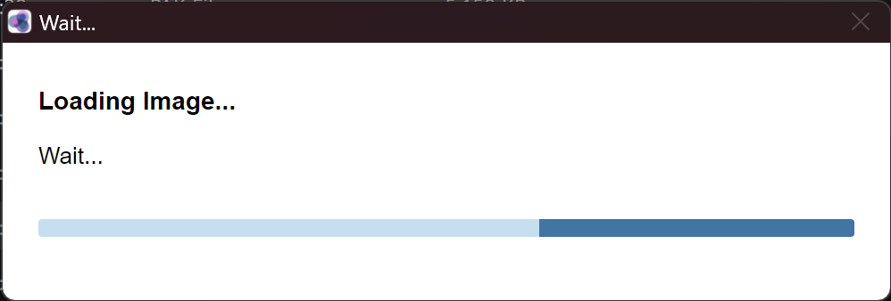

# Install SQUIRLS Assembler App on Windows

## 1. Prerequisites ##

* The following files are provided by DES.
  - Assembler app compressed file `assembler-win32-x64.zip`.
  - Docker image `assembly.tar.gz` file
* Docker engine for windows. E.g: https://docs.docker.com/desktop/install/windows-install/

## 2. Installation ##
- Create a folder to place all the files provided by DES. E.g. `assembler` 
- Unzip the assembler executable `assembler-win32-x64.zip` file in the `assembler` folder
- Start the Docker Desktop application.
- Double Click the executable file `assembler.exe`
 

- You will be prompted to `Load Image`. Click on it and choose the assembly.tar.gz provided by DES.

{width="40%"}

- A Loading modal will pop up. It takes around 5 minutes to load the image. Once the image is loaded the app will start automatically.
  
{width="40%"}
{width="60%"}